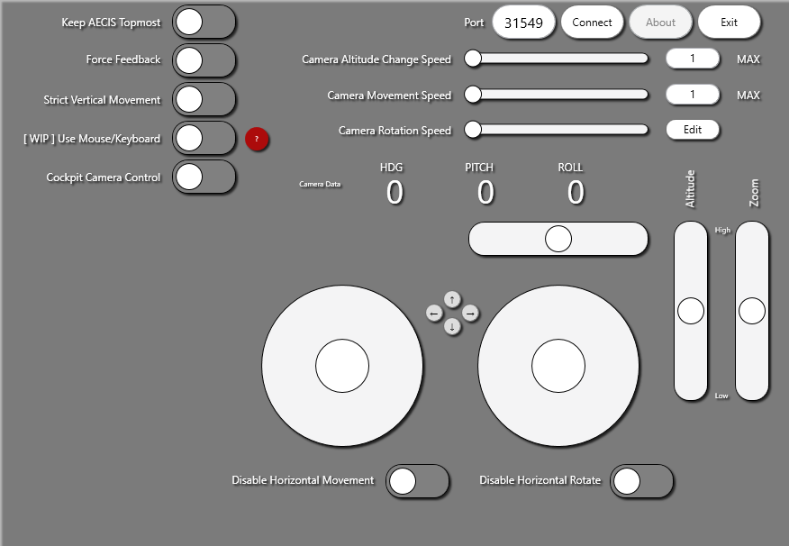

# DCS-External-Camera-Interaction-System
[点此阅读简体中文版说明](README_zh-CN.md)

Very early implementation of a camera control concept for DCS World, built in C# WPF.

**Important**

You can always undo the following steps to remove this software.
1. Remove the software itself
2. Remove DCS-AECIS.lua from your DCS folder in Saved Games
3. **Remove the following lines from Export.lua**

```
-- AECIS

local dcsAECIS=require('lfs');dofile(dcsAECIS.writedir()..[[Scripts\DCS-AECIS.lua]])
```

**Known Issues**
* On some occasion, after the Export.lua loads DCS-AECIS.lua file, their DCS simulation only runs at 1 fps.
* Some users report that the camera can not be rotated, neither by virtual joystick nor mouse control.
* Pop-up window may cause mouse and keyboard lag
* Being disconnected from DCS may cause mouse and keyboard lag
* Enabling Mouse/Keyborad Control may induce very extensive lag as well

I experienced none of above issue on my end though; need for information from users.


**How to intall to DCS**

It is necessary to add the following files to your ..\Users\\\<Your Username>\Saved Games\DCS\.\<Branch\>\Scripts
* DCS-AECIS.lua

If you do not have an Export.lua yet in the same folder, you should create your own.
In your file explorer, right click and choose New > Text Document. Then rename this file to Export.lua; make sure you change the extension name to .lua rather than Export.lua.txt

Add this line of code in your Export.lua, preferably at the end.


```-- AECIS

local dcsAECIS=require('lfs');dofile(dcsAECIS.writedir()..[[Scripts\DCS-AECIS.lua]])
```

This tells DCS to load AECIS in its own namespace/table.
After you start a mission, press F11 or LCtrl+F11 to switch to external camera. Press 'Connect' to try connecting to DCS. If the button changes to 'Disconnect', it means the TCP connection has been establish the Export function are working properly.

**Press and Hold LCtrl and drag with mouse to change window position.**


