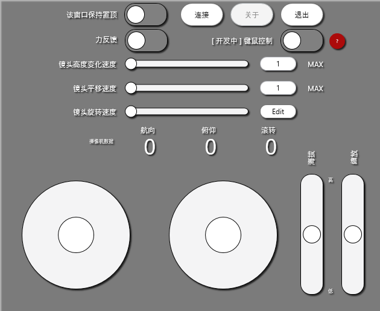

# DCS外部摄像机交互系统
这是一个非常初期的摄像机控制的概念的实现，使用CSharp WPF。

**如何安装和使用**

你需要在系统盘中的\用户\\\<你的用户名>\保存的游戏\DCS\.\<分支名称（如openbeta）\>\Scripts中加入下列文件。
* DCS-AECIS.lua

如果这个文件夹中没有Export.lua文件，你需要创建一个新的Export.lua
在文件管理器中，右键选择新建 > 文本文档。将这个文件重命名为Export.lua，注意，如果你的文件浏览器中不显示扩展名，重命名默认会是Export.lua.txt，则无法被DCS读取。

在这个文件的最后一行中写入如下代码：

`-- AECIS`

`local dcsAECIS=require('lfs');dofile(dcsAECIS.writedir()..[[Scripts\DCS-AECIS.lua]])`

这会让DCS在单独的命名空间/lua表中载入AECIS。
进入一个任务后，按F11或左Ctrl+F11来切换到自由视角模式。按“连接”来尝试连接到DCS。如果按钮变为“断开连接”，则表示TCP连接已经正确建立且Export.lua导出正常。

**按住左Ctrl并用鼠标拖动窗体来改变窗口位置。**

目前不熟悉如何在WPF中动态实现本地化。中文版本暂时在另一个Release中。

